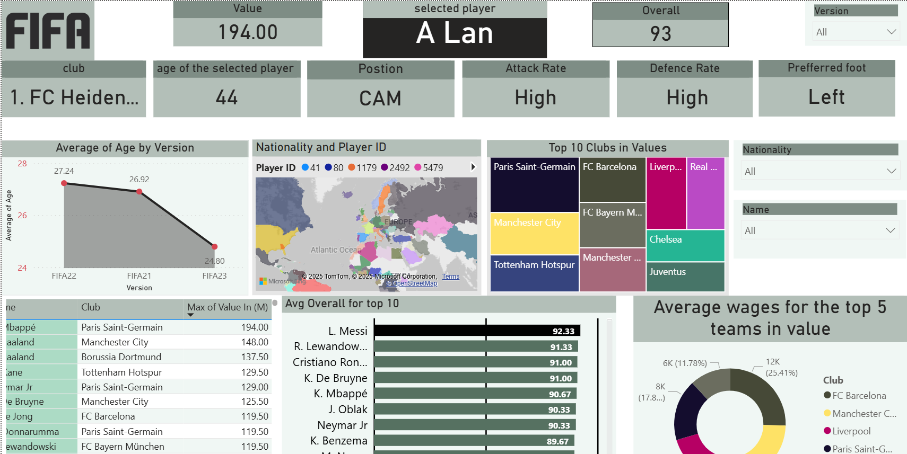
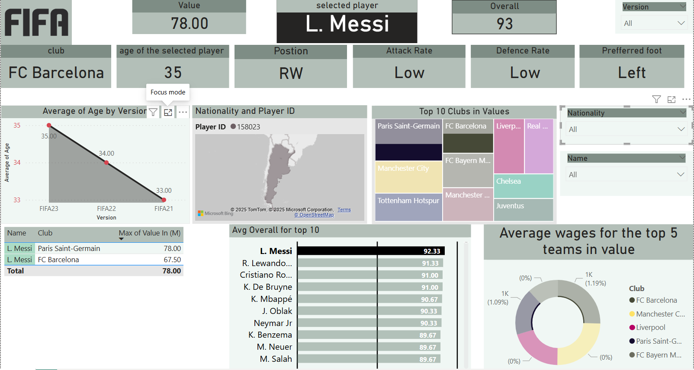
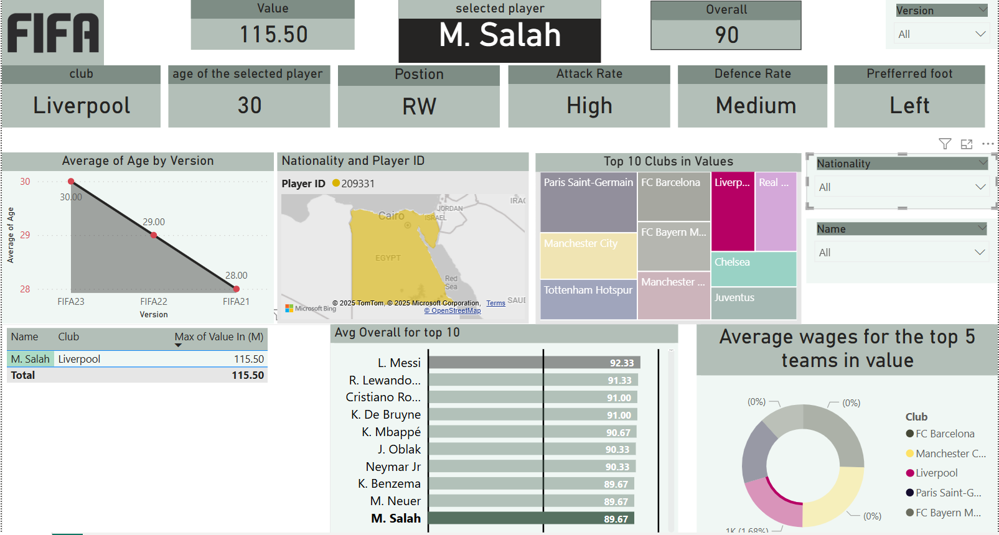

# ⚽ FIFA Dashboard - Power BI Project

An interactive Power BI dashboard analyzing FIFA player data across FIFA 21, FIFA 22, and FIFA 23.

---

## 🧹 Data Cleaning & Preparation

This project began with **raw, unprocessed FIFA player data**.

I cleaned and prepared the data from scratch using:
- **Python** (Pandas) for merging, filtering, and initial transformation
- **Power Query** inside Power BI and Excel for final data shaping and normalization

Key steps included:
- Removing duplicates and irrelevant fields
- Unifying column structures across versions
- Extracting and combining the **top 6,000 players** from each FIFA version based on their Overall rating
- Normalizing tables (up to 2NF) to improve performance and clarity in analysis

---

## 📊 Dashboard Features

- Analyze and compare player stats across multiple FIFA versions  
- Filter by club, nationality, rating, position, and more  
- View insights on player growth potential, top performers, and market value trends  
- Transfer tracking across years

---

## 📸 Dashboard Previews

### 🔹 Screenshots

  
  
  

### 🎥 Video Demo

[▶️ Watch Dashboard Walkthrough](Dashboard/Screenshots/fifa.mp4)

---

## 🛠️ Tools Used

- Power BI  
- Python (Pandas, NumPy)  
- Power Query  
- Git & GitHub

---

## 📂 Project Structure

